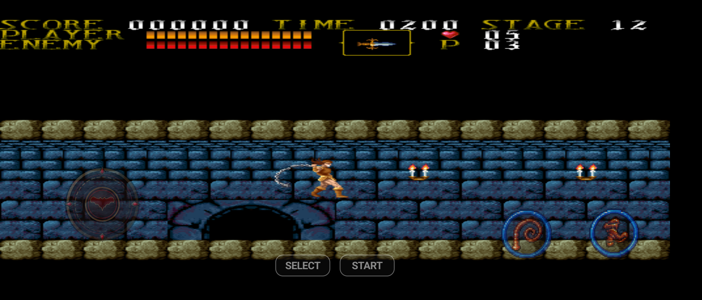
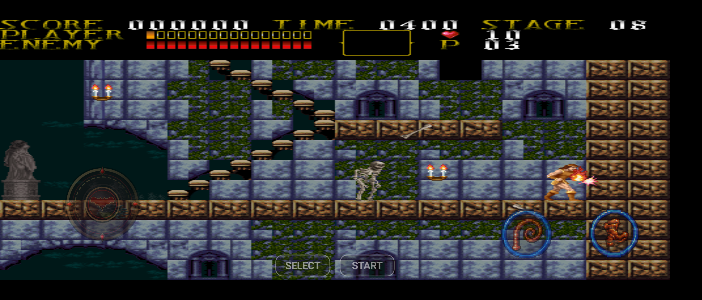
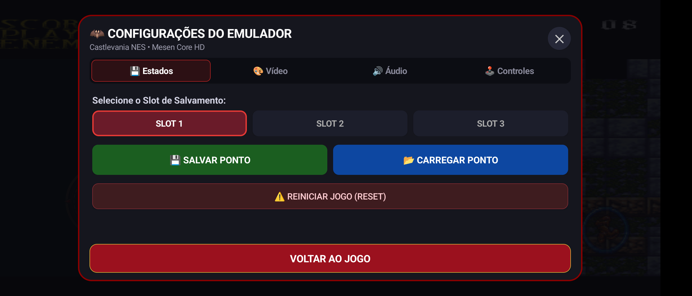
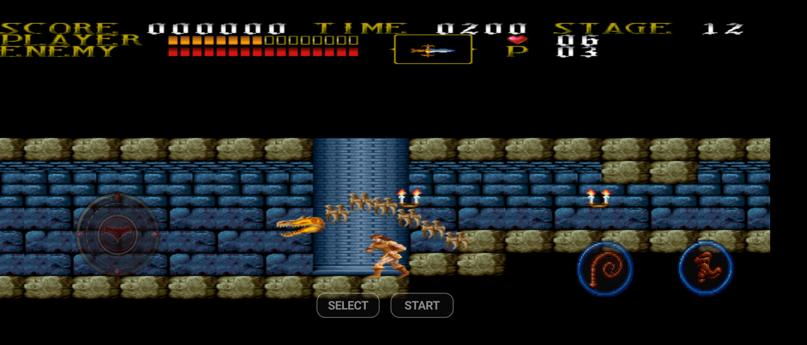

# 🦇 Castlevania NES — HD Remaster

[](https://github.com/OWNER/REPOSITORY/actions/workflows/build.yml)
[-3DDC84?logo=android&logoColor=white)](https://android.com)
[](https://developer.android.com/ndk)
[](https://github.com/SourMesen/Mesen2)
[](LICENSE)

clássico **Castlevania (NES)** para **Android**, trazendo suporte integrado ao pacote **HD Remaster** (texturas de alta definição e trilha sonora orquestrada) através do motor de emulação **Mesen** rodando via **C++ NDK (OpenGL ES 2.0)** e interface fluida em **Kotlin**.

---

## 📸 Capturas de Tela da Gameplay

<div align="center">

| Entrada do Castelo (Stage 01) | Ação e Movimentação com Simon |
| :---: | :---: |
|  |  |

| Menu de Configurações & Save States | Layout dos Controles de Toque |
| :---: | :---: |
|  |  |

</div>

---

## ✨ Destaques & Funcionalidades

- 🎨 **Gráficos HD Remasterizados:** Suporte nativo ao motor Mesen HD Pack (`hires.txt`), substituindo os blocos de 8-bits clássicos por cenários, tochas, inimigos e o Simon Belmont desenhados à mão em alta resolução.
- 🎵 **Áudio Orquestrado em Alta Definição:** Trilha sonora remasterizada com qualidade de estúdio (arquivos OGG sincronizados perfeitamente com os estágios do jogo).
- 🕹️ **Controles de Toque na Tela:**
  - Analógico direcional ergonômico para movimentação precisa.
  - Botões dedicados de ação (Ataque / Chicote e Pulo).
  - Barra dinâmica para disparo rápido de Sub-armas (Adaga, Machado, Cruz, Água Benta e Relógio).
  - Editor interativo para ajustar a escala, opacidade e posição dos botões na tela.
- ⚡ **Performance 60 FPS Sem Quedas:** Motor de emulação C++ altamente otimizado (`-O3`), renderizado diretamente em OpenGL ES 2.0 com latência ultrabaixa de áudio e vídeo.
- 💾 **Menu In-Game Completo:** Acesso instantâneo a **Save State**, **Load State**, seleção de filtros de vídeo, velocidade turbo e **controle independente de volume para a trilha sonora orquestrada do Mod HD** e para os efeitos sonoros.
- 📦 **Autossuficiente ("Standalone"):** O APK já inclui todos os arquivos de mod e ROM internamente; basta instalar e jogar sem precisar configurar pastas manualmente.

---

## 📁 Organização dos Diretórios

O repositório foi organizado para manter uma estrutura limpa e modular:

```
├── .github/workflows/       # Workflow de automação CI/CD (GitHub Actions)
├── android/                 # Projeto Android completo (Gradle, Kotlin, Recursos e JNI)
│   ├── app/src/main/assets/ # ROM base e mods.zip (HD Pack integrado)
│   ├── app/src/main/cpp/    # CMakeLists.txt e JNI Bridge C++
│   └── app/src/main/java/   # Código Kotlin (Renderer, Audio, UI, Controles)
├── third_party/             # Módulos externos e subsistemas C++ do emulador
│   ├── Core/                # Núcleo de emulação C++ Mesen (Shared, Audio, Video, Savestate)
│   ├── NES/                 # Implementação de hardware NES (CPU 6502, PPU, APU, HD Packs)
│   ├── SevenZip/            # Biblioteca C de descompressão LZMA / 7z
│   ├── Utilities/           # Utilitários (filtros de imagem spng, HQX, NTSC, áudio)
│   └── docs/                # Documentação técnica e screenshots da gameplay
└── .gitignore               # Exclusão de caches e saídas de compilação
```

---

## 🚀 Compilação Automática (GitHub Actions)

Você pode compilar o projeto automaticamente na nuvem sem precisar instalar o Android SDK ou NDK no seu computador:

1. Faça um **Push** para o seu repositório no GitHub ou abra a aba **Actions**.
2. Selecione o workflow **"Build Castlevania NES Android"**.
3. Clique em **Run workflow** (escolha entre `debug`, `release` ou `both`).
4. Quando o processo terminar, baixe o arquivo `.apk` pronto na seção **Artifacts**!
5. Se você criar uma tag de versão (ex: `git tag v1.0.0 && git push origin v1.0.0`), o GitHub Actions criará uma **Release** com o APK anexado automaticamente.

Para entender a lista completa de arquivos necessários para a compilação, consulte o [Guia Técnico de Compilação](third_party/docs/COMPILATION.md).

---

## 💻 Como Compilar Localmente

### Pré-requisitos:
- **JDK 17** instalado
- **Android SDK** (API 34)
- **NDK** `27.0.12077973`
- **CMake** `3.22.1`

### Passos:
```bash
# 1. Clone o repositório
git clone https://github.com/SEU_USUARIO/CASTLEVANIA-NES.git
cd CASTLEVANIA-NES

# 2. Acesse a pasta android e execute o build
cd android
chmod +x gradlew
./gradlew assembleDebug
```

O APK gerado para teste estará em:
`android/app/build/outputs/apk/debug/app-debug.apk`

---

## 📜 Licença & Créditos

- **Mesen Emulator Core:** Desenvolvido por Sour ([GPLv3](https://github.com/SourMesen/Mesen2)).
- **Castlevania:** © Konami (1986). Todos os direitos reservados aos detentores originais.
- **HD Remaster Pack:** Criado pela comunidade de entusiastas de HD Packs para o emulador Mesen.
